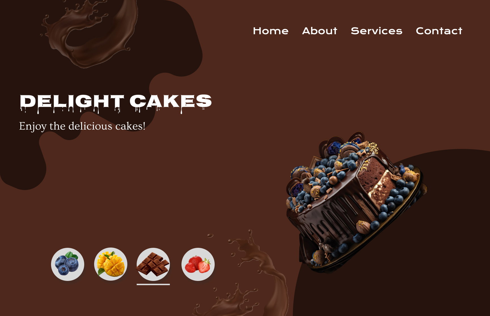

🍰 Cake Ordering App (UI/UX Design)

This is a **UI/UX design project** created in **Figma**.  
The app allows users to browse and order cakes with a simple, modern interface.  

Key Features
- Home screen with cake categories  
- Four flavors: **Blueberry, Mango, Chocolate, Strawberry**  
- Minimal, colorful design for easy navigation  
- Prototype flow for selecting and ordering  

🔗 Live Figma Prototype
[👉 View my Figma Design](https://www.figma.com/design/7q7Hr6eyf9BKbio6ehu55v/Desktop-UI?node-id=0-1&t=3eL2w6AgUIu6mU9B-1)

📸 Screenshots

Cake Flavors
- **Blueberry**

- **Mango**

- **Chocolate**

- **Strawberry**

💡 Designed with **Figma** as part of my UI/UX learning journey.
